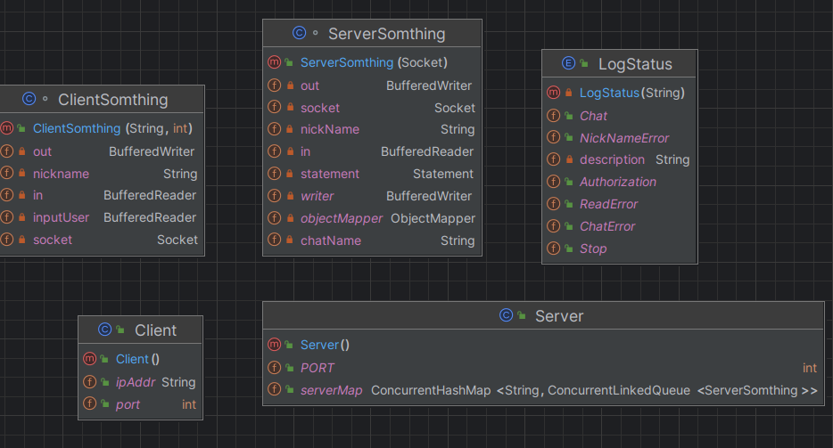

# Мессенджер

На данный момент запускается сервер. По сокетам к нему подключаются клиенты, указывают свою никнейм и чат. Все сообщения из чата сохраняются в БД SQLLite

## Запуск сервера

Для запуска сервера надо запустить ```Server.java```, после чего выйдет сообщение ```Server Started``` в случае успеха

## Подключение клиента

Клиент является объектом класса ```Client.java```. Он подключается по заданному адресу и порту к серверу

В случае успешного подключения, его попросят ввести свой ник: ```Press your nick:```. После чего предложат выбрать чат: ```Choose chat:```

Если в чате уже кто-то писал, то выпадет список сообщений
```agsl
Press your nick: 
danil
Choose chat: 
chat_1
Hello danil
You are in chat: chat_1
History messages
(19:53:40): Danil -- hi
(19:57:47): Danil -- hello
(19:57:53): Danil -- hi
(19:57:55): Danil -- fine
(20:05:19): Danil -- hi Dan
(20:05:28): Danil -- how are you
(20:05:44): Misha -- fine
(23:01:59): Daniil -- how
(2023-07-05): Daniel -- Daniel: hi
(2023-07-05): Daniil -- Daniil: how are you
/....
how are you
(2023-08-15 16:09:23) danil: how are you
```

Напишем сообщение ```how are you``` в чате и посмотрим, что выводит сервер:
```agsl
Server Started
{nickName=danil, time=2023-08-15 16:08:20, status=authorization}
danil joined to chat_1 in 2023-08-15 16:09:23
{nickName=danil, chatName=chat_1, time=2023-08-15 16:09:23, status=chat}
Echoing: chat_1 -- (2023-08-15 16:09:23) danil: how are you
```

Сервер логгирует события авторизации, выбора чата и отправки сообщения и записывает логги в файл ```log.txt```


## Перключение чатов и выход клиента

После того, как клиент подключился к чату, он может выйти из него, написав ```back``` после чего ему снова предложат выбрать чат

Выйти из мессенджера клиент может через команду ```stop``` внутри чата

## Структура проекта

